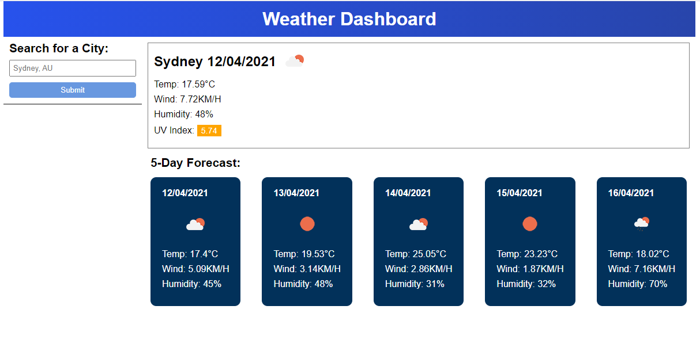
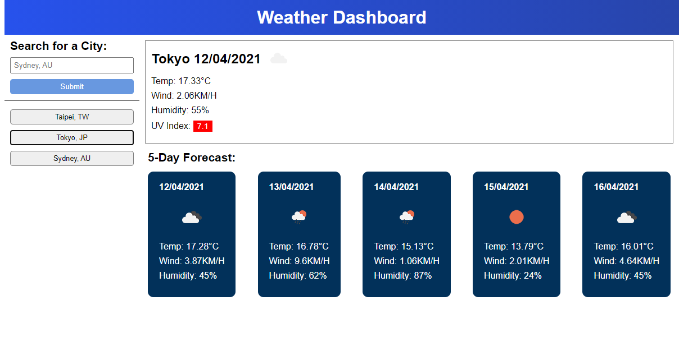

# Weather Dashboard

Please view the Weather Dashboard Project Here: [Weather Dashboard](https://leonhsu95.github.io/weather-dashboard/)

## Table of Contents

- [Installation](#installation)
- [Description](#description)
- [Technology](#technology)
- [Usage](#usage)
- [Credits](#credits)
- [License](#license)

## Description

The weather dashboard applications will allow users to search from cities by name and its projected weather forecast for the next 5 days.
In addition to this, the user can see the selected city's:

 * Current Date
 * Temperature
 * Wind Speed
 * Humidity
 * UV Index

## Technology

Technologies used include:

* HTML
* CSS
* JS
  * moment.js CDN
  * openweather API

## Installation

To install the files into your local repo, using Git Bash Terminal:

1) Create a folder locally to nominate for cloning from online repo
2) Clone with SSH by

```GitBash Commands
git clone git@github.com:leonhsu95/weather-dashboard.git"
 ```

## Usage

This landing page is a mockup and can be used and tested freely. If testing, please save a copy of the original files and edit on the copied file.
The website mockup should look like this:

 
 

## Credits

All resources were provided by "University of Sydney Bootcamp" [GitLab Repo](https://sydney.bootcampcontent.com/university-of-sydney/usyd-syd-fsf-pt-02-2021-u-c)
Weather API sourced freely and without copyright restriction from [OpenWeather](https://openweathermap.org/appid)
Project developed by Leon Hsu. 

## License

Copyright (c) [2021] [leonhsu95]

Permission is hereby granted, free of charge, to any person obtaining a copy
of this software and associated documentation files (the "Software"), to deal
in the Software without restriction, including without limitation the rights
to use, copy, modify, merge, publish, distribute, sublicense, and/or sell
copies of the Software, and to permit persons to whom the Software is
furnished to do so, subject to the following conditions:

The above copyright notice and this permission notice shall be included in all
copies or substantial portions of the Software.

THE SOFTWARE IS PROVIDED "AS IS", WITHOUT WARRANTY OF ANY KIND, EXPRESS OR
IMPLIED, INCLUDING BUT NOT LIMITED TO THE WARRANTIES OF MERCHANTABILITY,
FITNESS FOR A PARTICULAR PURPOSE AND NONINFRINGEMENT. IN NO EVENT SHALL THE
AUTHORS OR COPYRIGHT HOLDERS BE LIABLE FOR ANY CLAIM, DAMAGES OR OTHER
LIABILITY, WHETHER IN AN ACTION OF CONTRACT, TORT OR OTHERWISE, ARISING FROM,
OUT OF OR IN CONNECTION WITH THE SOFTWARE OR THE USE OR OTHER DEALINGS IN THE
SOFTWARE.

## Features

- The user can type any city name and the application will fetch the weather forecast of that city for the next 5 days.
- User saved cities are stored in local storage.
- User can click on any button to search for previous cities and its data.

## Future Improvements
- The site can be made responsive for better mobile UI.
- Alert signs can be added when user inputs invalid city.

## Tests

Website is validated with [HTML Markup Validation Tool](https://validator.w3.org/), [CSS Validation Service](https://jigsaw.w3.org/css-validator/) and [JS Validation Service](https://jshint.com/).
